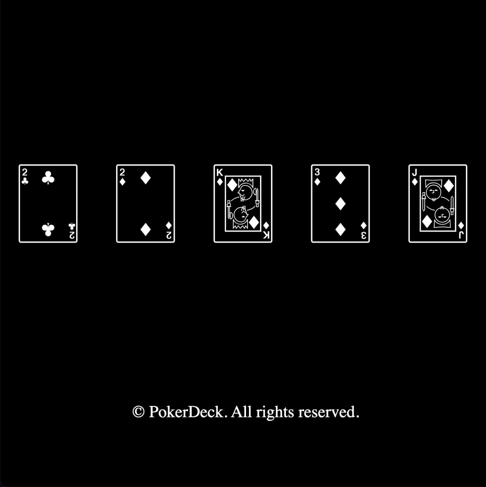

#

<center>
    
</center>

# PokerDeck

Algorithm-generated NFTs inspired by Poker hands.

# Explanation

Everytime user mint with a based-fee (50 ether/you can change to any price you want), the PokerDeck contract will generate a unique PokerDeck, includes 5 cards.
The rarity is defined by the value of the hand, similar to when evaluating a Poker hand.

# Deploy

```bash
npx hardhat run scripts/PokerDeck/deploy.ts --network <network-name-in-hardhat-config>
```

# License

The smart contract is MIT licensed.

# Disclaimer

The information provided by TraderTrou ("we," "us," or "our") on https://github.com/0xTraderTrou/trou-contracts (the "Site") is for general informational purposes only. All information on the Site is provided in good faith, however we make no representation or warranty of any kind, express or implied, regarding the accuracy, adequacy, validity, reliability, availability, or completeness of any information on the Site. UNDER NO CIRCUMSTANCE SHALL WE HAVE ANY LIABILITY TO YOU FOR ANY LOSS OR DAMAGE OF ANY KIND INCURRED AS A RESULT OF THE USE OF THE SITE OR RELIANCE ON ANY INFORMATION PROVIDED ON THE SITE. YOUR USE OF THE SITE AND YOUR RELIANCE ON ANY INFORMATION ON THE SITE IS SOLELY AT YOUR OWN RISK.